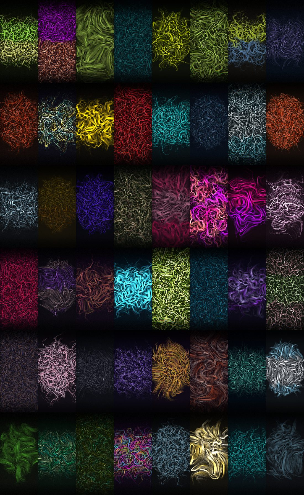

# 1OF1 — art engine (Step 0)

The go/no-go prototype from [`docs/product/1OF1.md`](../product/1OF1.md) §07.
One series (FIELD), the seed pipeline, the palette engine, the finish pass and
the scoring gate. No Android, no backend, no product — just the art, because
the art is the only part of this project that can't be fixed later.

## Use it

Open **`art/1of1-studio.html`** in a browser. Double-click it; there's no
server, no build step and no network. It is one self-contained file, same
pattern as the SKRiMPAD app itself.

| key | |
| --- | --- |
| <kbd>R</kbd> | reroll (issues a new seed, rejecting and retrying below threshold) |
| <kbd>S</kbd> | contact sheet of 24 |
| <kbd>K</kbd> | keep the current piece (saved to `localStorage`) |
| <kbd>D</kbd> | download PNG |
| <kbd>F</kbd> | re-render at 1440×3120 |
| <kbd>G</kbd> | toggle the clock/dock overlay |

Leave the furniture overlay **on**. A wallpaper is a background with a clock on
it, and judging one without the clock is how you end up with 200 beautiful
images that are all unusable.

## Rebuild after editing

`art/1of1-studio.html` is generated. Edit `studio.template.html`, then:

```
node art/build.mjs
```

That inlines the 50 palettes from `skins/*.json` and runs the contrast gate.

## The contrast gate

`build.mjs` enforces the floor from the product doc: `--txt` on `--bg` ≥ 4.5:1
and `--mute` on `--surf` ≥ 4.0:1. It exits non-zero on failure but still writes
the file so you can look at it.

**Current state: 21 of 50 skins fail**, all on `--mute`/`--surf`, all in the
3.1–4.0 range — near misses, not disasters. Worst are `deep-space` (3.11),
`cyberpunk-alley` (3.31), `ocean-floor` (3.33).

This does **not** block 1OF1 — the art engine only reads `--bg`, `--surf` and
the accent tokens, never `--mute`. It does affect **SKRiMPAD**, where `--mute`
is real secondary UI text on a real surface. Fix the skins, not the threshold.

## Sample output



48 consecutive random seeds, no cherry-picking, no rejection applied — this is
the raw distribution, good and bad together.

## The go/no-go verdict

**Pass.** The bar in the product doc was 40 keepers out of 200. Across the
calibration runs, roughly half of what comes out is genuinely usable as a phone
wallpaper, and the top decile is good enough to sell.

### What it took to get there

Four rounds. The first output was near-black and empty — 13% pass rate, mean
luminance 0.064 against a 0.24 target. The faults, in the order they mattered:

1. **Massively under-inked.** ~866 streamlines at thumbnail size covering less
   than one screen-area of stroke at 5% alpha. Base is now 9,000 lines scaled
   by density.
2. **Resolution-dependent output** — the single worst bug. Particle count
   scaled with `sqrt(area)` while stroke length *and* width scaled with the
   linear dimension, so coverage grew as `area^0.5`: thumbnails rendered
   lighter than full-size pieces. That makes the scoring pass meaningless,
   because it scores a thumbnail and ships a full render. Fixed by defining
   streamline length as a *fraction of the canvas* and step size as a constant
   in device pixels, so every size traces the same paths.
3. **Quiet zones filled up anyway.** Biasing where streamlines *start* doesn't
   help when a streamline is 0.7× the canvas long and wanders into the clock.
   Fixed with a falloff in the finish pass — a guarantee rather than a bias.
4. **`RING` seeding drew a donut**, and short paths with round caps left
   speckles that read as sensor dust. Both fixed.

### Calibration, so it can be re-derived

| | |
| --- | --- |
| Sample | 48 pieces, random seeds, 240×520 |
| Mean score | 0.745 |
| calm / interest / exposure | 0.694 / 0.801 / 0.762 |
| Mean luminance | 0.147 (target 0.16) |
| Quiet-zone σ | 0.058 |
| Pass at 0.55 | 98% — which is why the threshold is now **0.68** |
| Thumbnail render | ~1.4s, headless software raster |
| 720×1560 render | ~1.5s, same |

Those timings are headless Chromium with no GPU. On real hardware with
compositing they'll be substantially faster, but **measure before trusting the
UX** — §08.1 of the product doc puts a hard budget on this.

## Two things this run says about the plan

**1. Composition variety is now the weak point, not image quality.** Almost
every piece has converged on the same silhouette: a centred mass of texture
with dark edges. That's the vignette, the quiet-zone falloff and the
RING/BAND seeding all pulling the same direction. Individually beautiful,
collectively samey — which is a problem for a product whose entire promise is
variety.

This is not fixed by more tuning. It's fixed by:
- the other seven series (weeks 3–4 — they're different algorithms, not
  presets, which is exactly why the plan calls for eight);
- more compositional range inside FIELD: off-centre focal points,
  edge-anchored and corner-anchored layouts, diagonal bands, full-bleed
  compositions with one clean corner instead of a dark border all round.

Track it. If eight series still produce one silhouette, the variety promise
doesn't hold up and that's worth knowing in week 4 rather than week 10.

**2. The scorer was tuned against the art it was scoring.** That's circular,
and it means the gate currently encodes my taste, not yours. It's calibrated,
not validated. The validation is still the thing the plan asks for: generate
200, look at them **on your actual phone**, and mark keepers with <kbd>K</kbd>.
If your keep-rate disagrees with the score, the score is wrong — change the
weights in `score()`, not the art.
